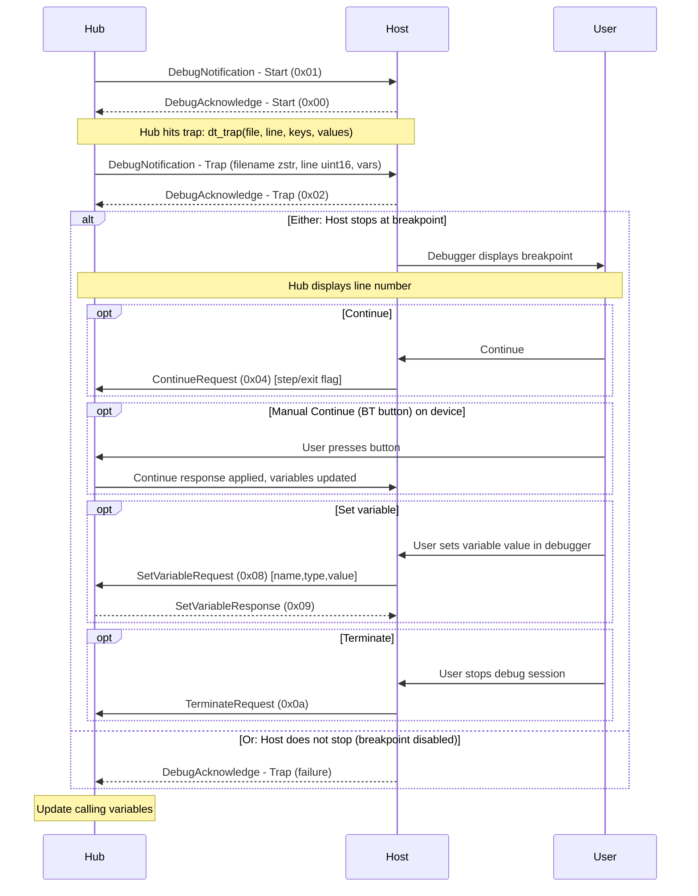

# Debugging message (0x71 / 0x70)

The VS Code extension provides a Debug Adapter (DAP) that bridges the editor and
the hub over AIPP. It translates VS Code DAP requests/events into AIPP debug
messages and vice‑versa:

- Start/attach: DAP initialize/attach → Start Acknowledge/Notification exchange
  over AIPP.
- Breakpoints/traps: Hub Trap Notification → DAP "stopped" event; the adapter
  requests variables and scopes from the hub to populate the UI.
- Execution control: DAP continue/step/stop → AIPP Continue/Terminate requests;
  adapter forwards Acknowledge/Response messages back as DAP events.
- Variables: Get/Set variable DAP operations map to AIPP Get/Set requests;
  variable types (int/float/string/bool) are converted according to AIPP
  encoding (zstrings, little‑endian numeric packing).
- Robustness: the adapter handles AIPP framing, chunking and checksum retry
  logic and exposes basic DAP features; advanced DAP features (conditional
  breakpoints, expression evaluation) require explicit support in the extension.

This keeps the editor integration lightweight while exposing a familiar DAP
debugging experience backed by the AIPP debug protocol.

Notes:

- VSCode extension does a **precompile step** and injects debug trap codes on
  any breakpoints. Trap call is injected before the line of code, currently in
  the same line to keep line numbers consistend in case of an exception message.
- Python code is scanned for local variables that can be used for the debug
  session. This includes any local variables, that are declared beforehands via
  assignment.

  ```python
  s = "hello world"
  def test1():
    i = 12      # breakpoint will not display "i"
    print(i)    # breakpoint shows value of "i", allows set value
    print(i,s)  # breakpoint will include "i" and "s""
  ```

- Control statements are not debuggable: for, while, def, class ...

## Debugging subcodes

- Start Notification/Acknowledge: 0x01 / 0x00
- Trap Notification/Acknowledge: 0x03 / 0x02
- Continue Request/Response: 0x04 / 0x05
- Get Variable Request/Response: 0x06 / 0x07
- Set Variable Request/Response: 0x08 / 0x09
- Terminate Request: 0x0a / 0x0b

## Variable types

- None/null/undefined = 0x00
- Integer (signed, 16-bit) = 0x01
- Float = 0x02
- String = 0x03
- Boolen = 0x04

## Debug protocol flow (typical)

1. Hub sends a Start Notification (DebugNotification, subcode 0x01).
2. Host replies with Start Acknowledge (DebugAcknowledge, subcode 0x00).
3. When the hub hits a trap point dt_trap(file, line, keys, values) is called:
   - Hub encodes a Trap Notification with filename (zstring), line (uint16) and
     exposed variables.
   - Host replies with Trap Acknowledge (0x02) then may send:
     - Continue Request (0x04) with step/exit flag.
     - Set Variable Request (0x08) to change a variable value; hub replies with
       Set Variable Response (0x09).
     - Terminate Request (0x0a) to stop interactive loop.
   - Host replies with Trap Acknowledge (0x02) with failure if it does not want
     to stop on the breakpoint.
4. The hub may show line number on the display and supports manual continue via
   Bluetooth button.
5. After the continue response all variables values are set according to the
   user-set state


